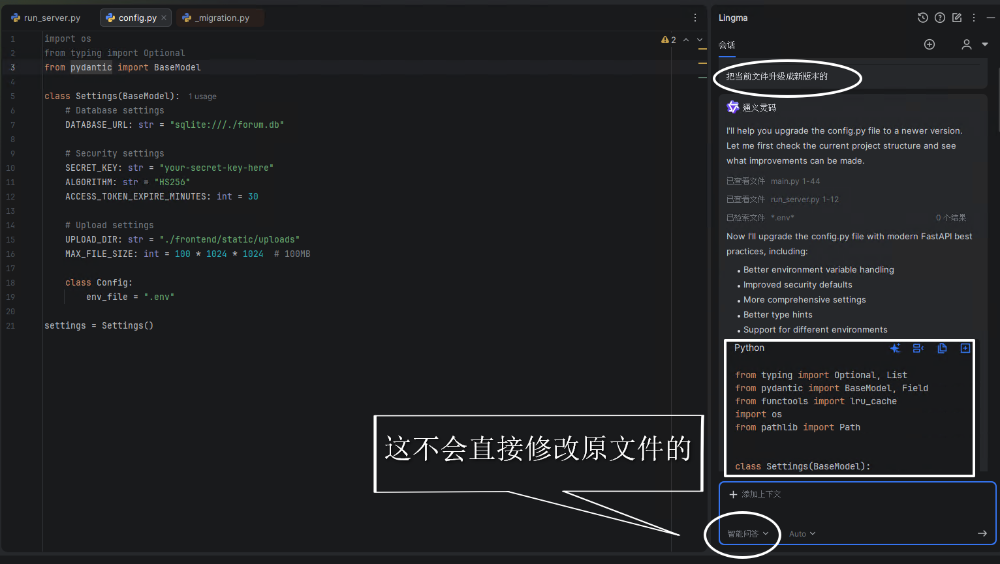
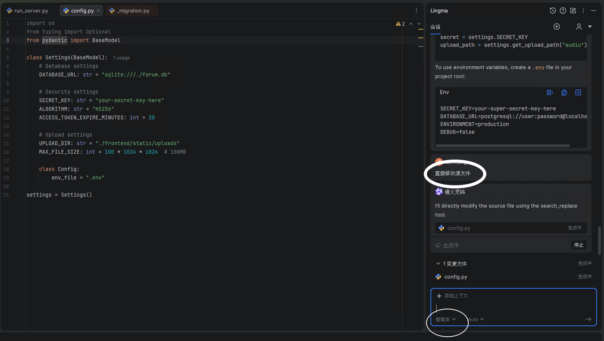
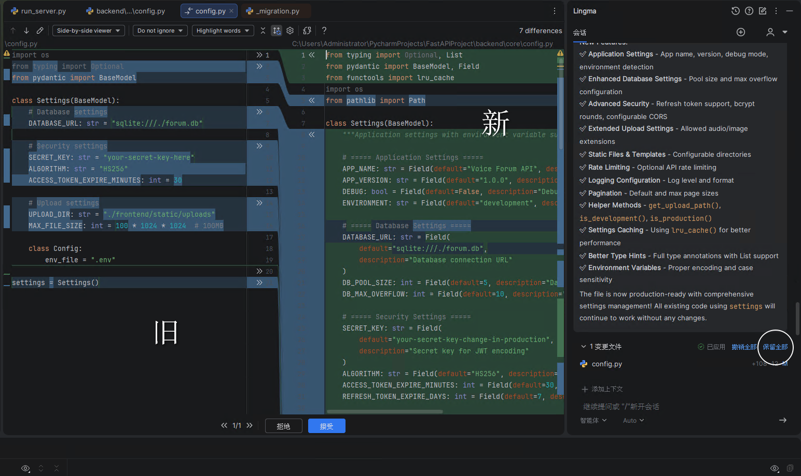
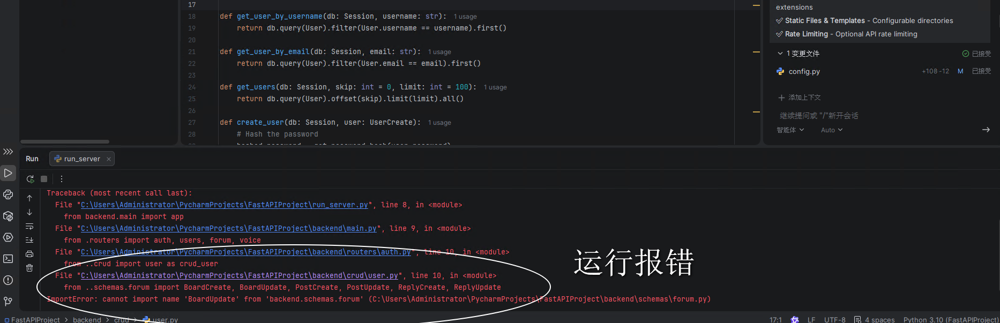
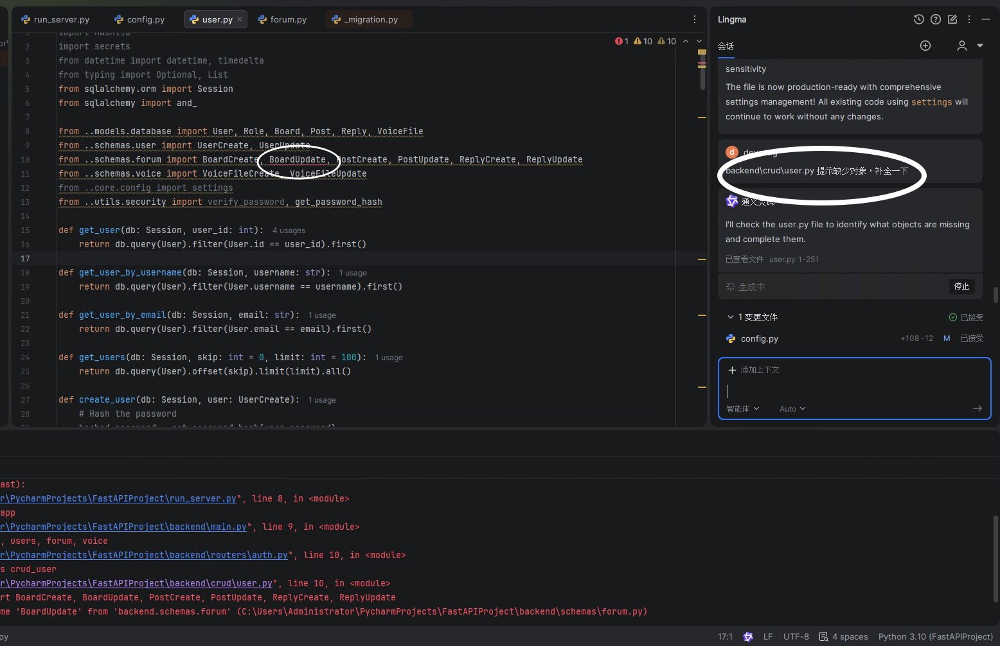
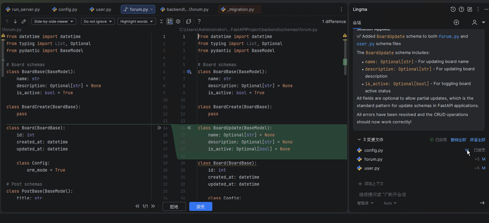
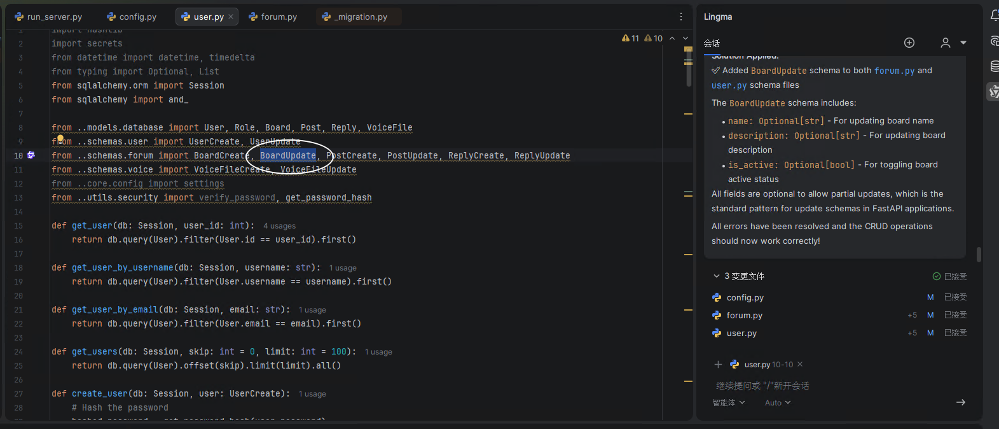
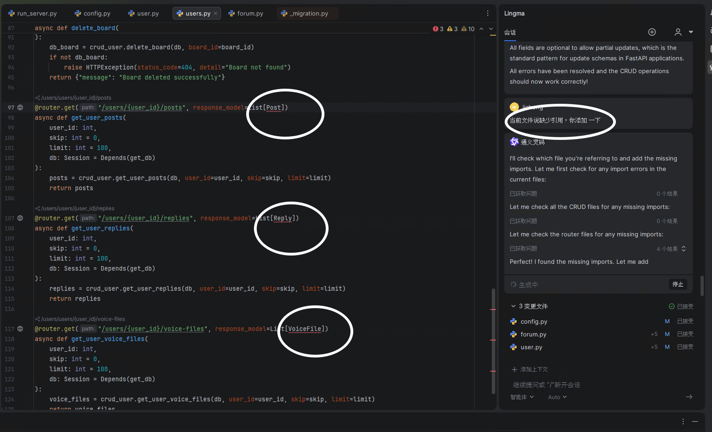
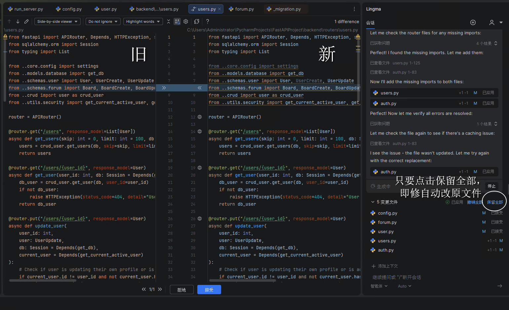
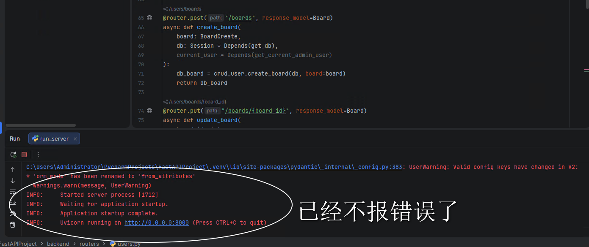

近日试了 PyCharm + qwen-coder(LingMa plugin) 写Python代码、修改代码、等尝试。

PyCharm(主要是python) 和 Idea(主要是java)，相似的。

#### 测试步骤 - 1

#### 测试步骤 - 2

#### 测试步骤 - 3

#### 测试步骤 - 4

#### 测试步骤 - 5

#### 测试步骤 - 6

#### 测试步骤 - 7

#### 测试步骤 - 8

#### 测试步骤 - 9

#### 测试步骤 - 10

